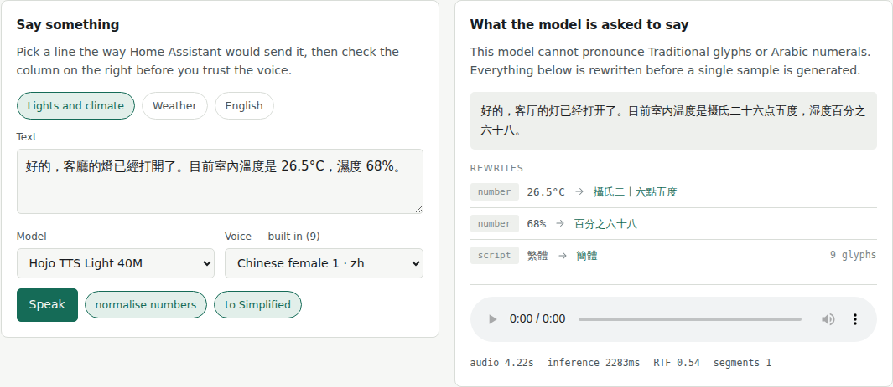
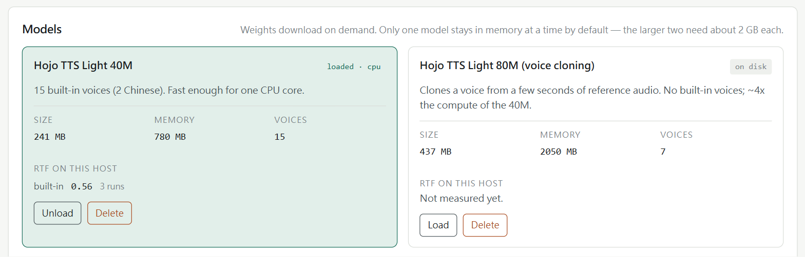

# Cortex TTS

Home Assistant app providing on-device text-to-speech: a catalog of models
run on your own CPU or GPU, with built-in voices, voices designed from a set
of attributes, or one cloned from a short recording — plus the Chinese text
front-end none of the models ship. No cloud, no per-character bill.

## Features

- **Runs on your hardware** — inference happens locally, on the CPU or on a
  GPU where one answers. No cloud, no API key, no per-character bill.
- **Built-in voices, or your own** — most of the models clone a voice from a
  short reference recording, and a recording is the same voice on every model
  that can.
- **The text pipeline the models lack** — Traditional-to-Simplified conversion
  and number, unit, date and clock expansion, without which they are
  unintelligible for Chinese; and Taiwan readings (垃圾 lè sè, 企業 qì yè),
  which no model has, respelled by homophone so every model says them.
- **An admin UI that shows its work** — the prepared text and a ledger of
  every rewrite, beside the composer.
- **Streaming is per model, and off until you ask** — one fast enough to
  outrun the speaker can start on the opening sentences; a slower one is
  buffered on purpose, because a stream that falls behind stutters.
- **Discovered by Home Assistant** through the Supervisor, so the companion
  integration needs no address or key typed in.

## Models

| Model                                                          | Voices                            | Languages  |
| -------------------------------------------------------------- | --------------------------------- | ---------- |
| [Hojo TTS Light 40M](https://github.com/HojoAI/Hojo-TTS-Light) | 15 built in (2 zh, 13 en)         | zh, en     |
| [Hojo TTS Light 80M](https://github.com/HojoAI/Hojo-TTS-Light) | clones only                       | zh, en     |
| [MOSS-TTS-Nano](https://github.com/OpenMOSS/MOSS-TTS-Nano)     | 18 built in (6 zh) **and** clones | zh, en, ja |

Nothing is baked into the image; each is downloaded from the app's own UI on
first use. What each costs, how each clones and which to pick is
[docs/models.md](cortex-tts/docs/models.md).

## Admin UI

The ingress panel doubles as the test bench. It shows the prepared text —
what the model is actually asked to say — beside a ledger of what each pass
rewrote, because that rewrite is the whole product and a voice that mangles
a temperature is the symptom you would otherwise have to guess at.

It also manages the models — download, load, evict — and the cloned voices,
including the transcript each reference recording is bound to. A card carries
what the model costs to keep, and the real-time factor **this** host has
measured, or says it has none yet: no figure from anyone else's machine.

## Installation

**1. Install this app.**

Start it, open its Web UI and download a model — nothing is baked into the
image.

**2. Install the companion integration.**

It lives in [hass-cortex/cortex-tts][integration] and Home Assistant has no
Cortex TTS platform without it: no integration, no discovery card, and no voices in
the pipeline picker. Restart Home Assistant after adding it, and the running
app is then discovered by itself.

The App Store page, [cortex-tts/DOCS.md](cortex-tts/DOCS.md), has the rest:
configuration, settings and troubleshooting.

[integration]: https://github.com/hass-cortex/cortex-tts

## Documentation

| Page                                                  | What it covers                                                   |
| ----------------------------------------------------- | ---------------------------------------------------------------- |
| [Models](cortex-tts/docs/models.md)                   | The line-up, what each costs, how each clones, which to pick     |
| [The text pipeline](cortex-tts/docs/text-pipeline.md) | Why Traditional Chinese and numbers are rewritten, and into what |
| [Cloned voices](cortex-tts/docs/cloning.md)           | The recording, the transcript, the name                          |
| [Keeping up](cortex-tts/docs/streaming.md)            | Buffered, streamed, and the sensors that decide it               |
| [Running it elsewhere](cortex-tts/docs/standalone.md) | A faster CPU or a GPU outside Home Assistant OS                  |
| [HTTP API](cortex-tts/docs/api.md)                    | Using the app without the integration                            |
| [App Store page](cortex-tts/DOCS.md)                  | Install, configure, troubleshoot                                 |

## Acknowledgements

- [Hojo TTS Light](https://github.com/HojoAI/Hojo-TTS-Light) and
  [MOSS-TTS-Nano](https://github.com/OpenMOSS/MOSS-TTS-Nano) — the ONNX models
  this app serves.

## License

MIT — see [LICENSE.md](LICENSE.md).
